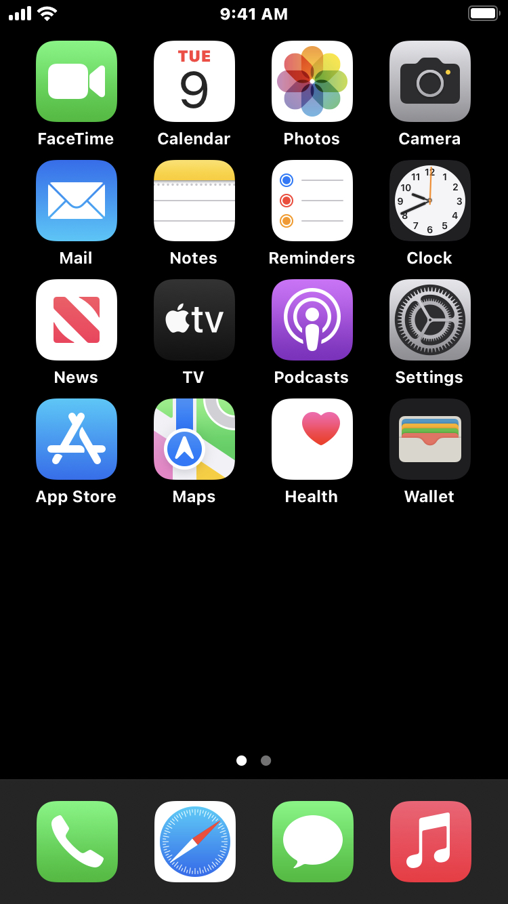
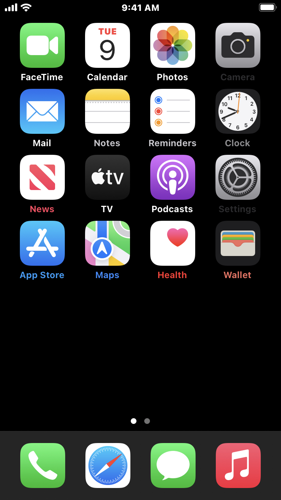

# MatchingIconLabels
Match icon labels colors to their icons. Made as a tweak bounty.

Bounty:
https://www.reddit.com/r/TweakBounty/comments/1jhw370/10166_tweak_to_make_icon_labels_like_app_icon.

### Screenshots

Before            |  After
:-------------------------:|:-------------------------:
  |  

### How to install
Head over to the [Releases](https://github.com/NightwindDev/MatchingIconLabels/releases) section and download the correct `.deb` for your device.

### How to compile manually
Make sure you have [Theos](https://github.com/theos/theos) installed and configured.

Clone the repo and run the command you need:
```bash
# To build for rootful
make clean package FINALPACKAGE=1
# To build for rootless
make clean package THEOS_PACKAGE_SCHEME=rootless FINALPACKAGE=1
```

#### License
This project is licensed under [MIT](LICENSE).

###### Copyright (c) 2025 Nightwind